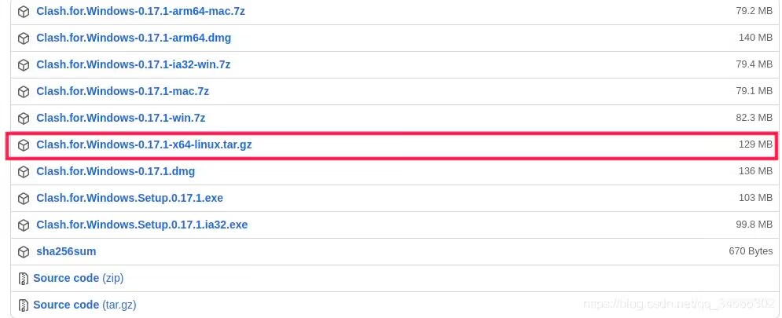

## CLASH FOR WINDOWS 如何在Linux上使用

### # 1. 安装clash for windows

点开链接,选择clash for windows的linux版本

[clash]: https://github.com/Fndroid/clash_for_windows_pkg/releases/tag/0.17.

### 打开clash

`cd clash`

`./cfw`

设置clah

### 修改配置文件

`sodo gedit /etc/environment`

### 添加以下内容并保存

    http_proxy=http://127.0.0.1:7890/ 
    https_proxy=http://127.0.0.1:7890/ 
    ftp_proxy=http://127.0.0.1:7890/ 
    HTTP_PROXY=http://127.0.0.1:7890/ 
    HTTPS_PROXY=http://127.0.0.1:7890/ 
    FTP_PROXY=http://127.0.0.1:7890/

