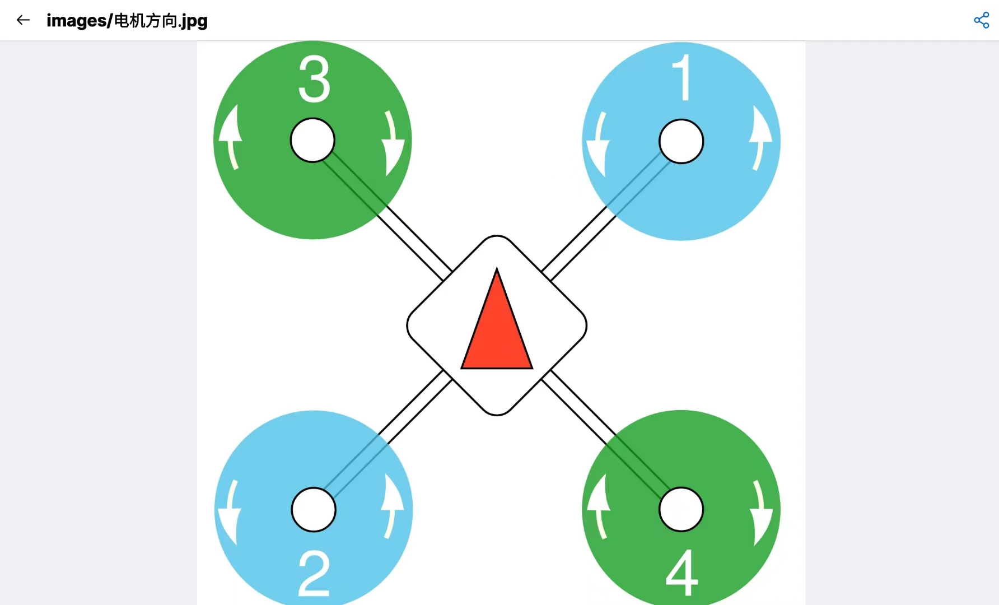
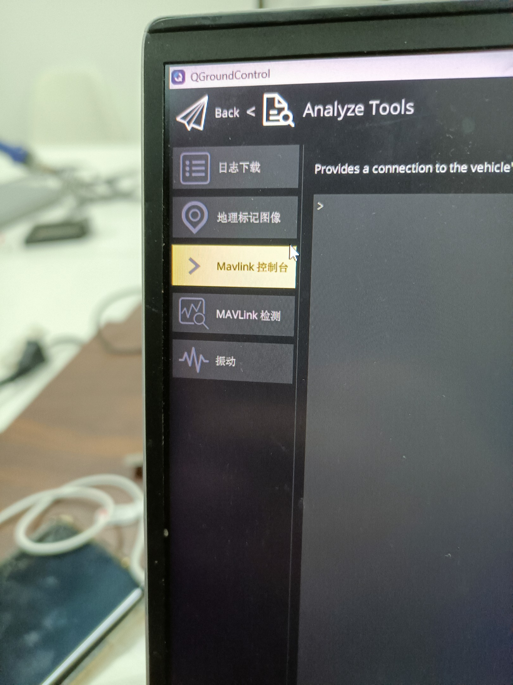
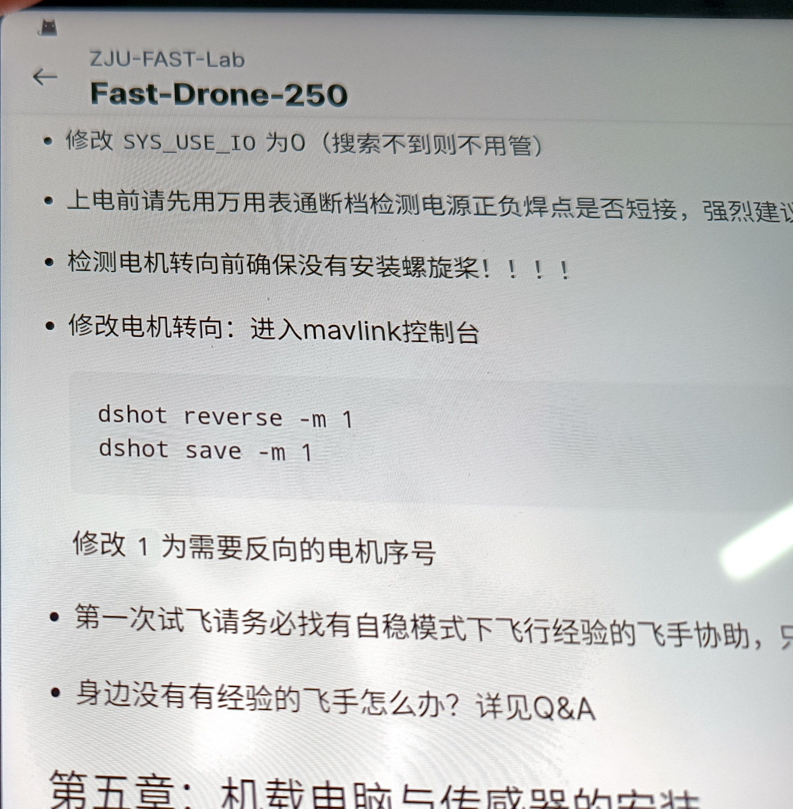

## QGC相关参数更改

`dshort_config` 调整电机

`CBRK_USB_CHK` 为了让插了USB之后还可以解锁

`CBRK_IO_SAFETY` 跳过安全开关

`SYS_TEL1_BAUD`改串口波特率

## 怎么调电机顺序

### QGC确定电机顺序,和顺逆时针

白色是地线，下面是信号线，插好后是蓝色

电机顺序如果反了，就调信号线

*顺逆时针反了就在QGC中输命令*

命令1是调顺逆时针，1可替换未2 3 4

命令二是保存

